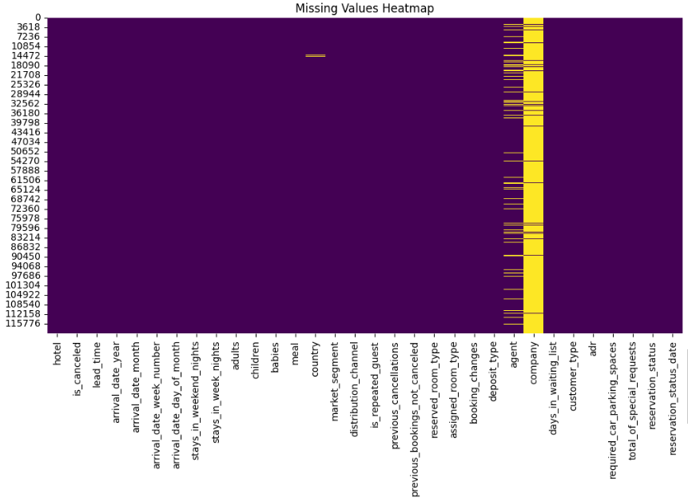
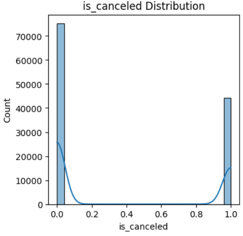

# 🏨 호텔 예약 취소 예측 모델

## 개요
1️⃣ 프로젝트 소개<br>
2️⃣ 데이터셋 소개<br>
3️⃣ 기술 스택 및 파일 구조<br>
4️⃣ 데이터 전처리<br>
5️⃣ 모델 구현<br>
6️⃣ Application 구현<br>
7️⃣ 기대효과<br>
8️⃣ 실행방법<br>
📶 한줄회고
<div align="center">


</div>

## 팀원
| 이름 | 전우영 | 이성진 | 최자슈아주원 | 유성현(팀장) | 진승언 |
|:------:|:------:|:------:|:------:|:------:|:------:|
| **역할** | EDA<br>모델링<br>문서화<br>고객 상세 페이지 구현 | EDA<br>모델링<br>관리자 대시보드 구현 | EDA<br>모델링<br>고객 예약 페이지 구현 | EDA<br>모델링<br>고객 예약 페이지 구현 | EDA<br>모델링<br>문서화 |

----

## 프로젝트 소개
본 프로젝트는 호텔 예약 데이터를 기반으로 머신러닝을 활용하여 고객의 예약 취소 가능성을 예측하고, 예측 결과를 실시간으로 확인할 수 있는 대시보드 시스템을 구현한 프로젝트입니다.

## 프로젝트 목표
- 호텔 예약 취소 예측 모델 개발
- LightGBM 기반 고성능 분류 모델 구현
- Streamlit을 활용한 실시간 예측 시스템 구축
- 고객 맞춤형 예약 관리 대시보드 제공

----

## 데이터셋

### 데이터 출처
이 데이터셋은 시티 호텔과 리조트 호텔의 예약 정보를 포함하고 있으며, 예약 시기, 숙박 기간, 성인/어린이/유아 수, 주차 공간 수 등의 정보가 담겨 있습니다.

### 주요 특징
- **총 데이터 수**: 약 119,390건
- **호텔 유형**: City Hotel, Resort Hotel
- **예측 목표**: 예약 취소 여부 (is_canceled)

----

## 기술 스택

**Libraries**


**Environment & Tools**


----
## 프로젝트 구조

```
SKN21-2nd-5Team/
├── data/                    # 데이터 파일
│   ├── hotel_bookings.csv
│   └── images/
├── modeling/                # 모델 학습 코드
│   ├── v1.py               # LightGBM 학습
│   └── predict.py          # 예측 함수
├── streamlit/              # Streamlit 앱
│   ├── pages/
│   │   └── guest_pg.py     # 사용자 페이지
│   └── main.py
├── model/                  # 저장된 모델
│   ├── lgbm_model.txt
│   └── feature_columns.pkl
├── EDA/                    # 탐색적 데이터 분석
└── README.md
```

----
## 데이터 전처리

### 1. 피처 엔지니어링
- **가족 여부 판별**: `is_family` - 어린이나 유아가 있는 경우
- **예약 리드타임 그룹화**: `lead_time_group` - 당일/단기/중기/장기 예약 구분
- **국가 그룹화**: `country_grouped` - 주요 국가 vs 기타 국가
- **특별 요청 여부**: `has_special_requests` - 특별 요청 존재 여부
- **주차 필요 여부**: `needs_parking` - 주차 공간 필요 여부

### 2. 데이터 정제
- 데이터 누수 컬럼 제거: `reservation_status_date`
- 중복 정보 컬럼 제거: `arrival_date_month`
- 결측치 처리: 수치형(0), 범주형('Unknown')

- One-Hot Encoding 적용: 범주형 변수 변환

### 3. 데이터 분할
- Train/Validation: 80/20 비율
- Stratified Split 적용 (클래스 불균형 고려)  


----

## 모델 구현

### LightGBM 모델
대부분 정형 데이터이기에 Tree based 모델인 XGBoost, LGBM, CatBoost 등 중에서 baseline 성능이 가장 좋은 모델을 선택 
  
### Optuna를 통한 자동하이퍼 파라미터 튜닝  
n_estimators, learning_rate, max_depth 등의 하이퍼파라미터들을 optuna 라이브러리를 통해 자동으로 찾아 최적화

### 모델 최종 성능

```
----------------------------------------
Model Accuracy: 0.8929
----------------------------------------
Classification Report:

              precision    recall  f1-score   support

           0       0.92      0.91      0.91     22550
           1       0.85      0.87      0.86     13267

    accuracy                           0.89     35817
   macro avg       0.88      0.89      0.89     35817
weighted avg       0.89      0.89      0.89     35817

=== 추가 성능 지표 ===
AUC-ROC: 0.9598
Recall: 0.8658
F1-Score: 0.8570
```

----

## Streamlit 활용 시스템 구현

### 1. 사용자 호텔 예약 페이지
- 개인 예약 정보 입력

### 2. 관리자 대시보드
- 예약 현황 통계
- 취소율 분석
- 시각화 차트 제공
- 개인 예약 내역 조회 가능
----

## 기대효과

### 1. 고객 관리
- 취소 위험 고객 대상 프로모션
- 고객 특별 요청 사항 모니터링 및 개선  
- 오버부킹을 통한 수익 증대

### 2. 운영 효율화
- 데이터 기반 의사결정
- 자원 배분 최적화
- 실시간 예측 시스템 활용

----

### 개선 가능성
1. **모델 개선**
   - 앙상블 모델 적용
   - 추가 피처 엔지니어링

2. **데이터 확장**
   - 특별 요청 사항과 같은 자연어 데이터 사용
----


## 실행 방법

### 1. 환경 설정
```bash
pip install pandas numpy scikit-learn lightgbm streamlit
```

### 2. 모델 학습
```bash
python modeling/v1.py
```

### 3. Streamlit 앱 실행
```bash
streamlit run streamlit/main.py
```

----

## 한 줄 회고

> #### 전우영
> 첫 프로젝트 끝난 게 엊그제 같은데 벌써 두 번째 프로젝트라니 ,, 믿기지 않습니다. 첫 번째에서 streamlit 구현했던 경험을 바탕으로 개별 고객 데이터와 통계를 조회할 수 있는 페이지를 만들었는데요. 첫 프로젝트 때는 팀원들의 도움을 받아 뒷 부분을 팀원을 코드로 채웠던 반면 ,, ^^;; 이번에는 제 힘으로 페이지를 완성했다는 것이 장족의 발전이라 생각합니다. 이전에 Keggle 타이타닉 대회 맛보기했던 이력을 바탕으로 EDA와 Preprocessing도 해보고, 사용되지는 않았지만 나름 모델도 만들어 보니 이제야 흐름이 조금은 보입니다. 전 과정에 큰 역할을 한 건 아니지만 발 정도는 담그며 최선을 다한 것 같습니다. 함께한 팀원드라 ~~ 고마워(습니다)✨
🙏🏻
 우리팀 쵝.오. 
---

> #### 이성진
> 프로그래밍 입문, 대략 두 달. 두 번째 프로젝트는 고객 이탈 예측 모델 만들기. 데이터 찾고, 전처리 하고, 모델 돌리고, 안 되고, 피처 가공하고, 모델 돌리고, 또 안 되고, 가공하고 돌리고 안 되고, 뭐가 문젠데? 이런 과정 중에 맛은 본 것 같다. 아직 맛을 아는 것 같진 않고. 팀원 4명의 99% 능력에 빌붙어 (내게는 한없이) 복잡한 문제를 풀어 낸 성장의 발판이었을지도 모른다고, 포장해 본다.
---

> #### 최자슈아주원
> 첫프로젝트 때는 코드를 거의 읽을 수가 없었는데 이번에는 코드를 어느정도 보면서 작업이 되어서
많이 발전했다고 느꼈습니다. 특히 프론트 작업을 하면서 streamlit에서 하위 디렉토리를 사용하여 파이썬 파일을 구현하고 권한을 부여하는 부분이 인상이 깊게 남았습니다. 이번 프로젝트에서 비즈니스와 머신러닝을 메인 키워드로 잡고 작업을 진행하여 주제에서 이탈하는 부분은 과감히 포기하고 메인에 집중하는 선택을 했는데 이러한 방식을 이행하는 것이 성공적이었다고 생각합니다. 호텔예약페이지만 구현을 하고 호텔페이지를 구현하지못한 것은 아쉽다고 생각을 합니다.
---

> #### 유성현
> 데이터의 성능을 생각하며 feature를 수정할떄마다 뇌에 에러가 발생하는 것 같았다.

---

> #### 진승언
> 도메인 내용을 모르니 EDA를 어떻게 시작해야할지 감이 안오고 어려운 부분이 많았고, 피처 선택, 모델 선택 등이 어려워 힘들었음.
---
  
